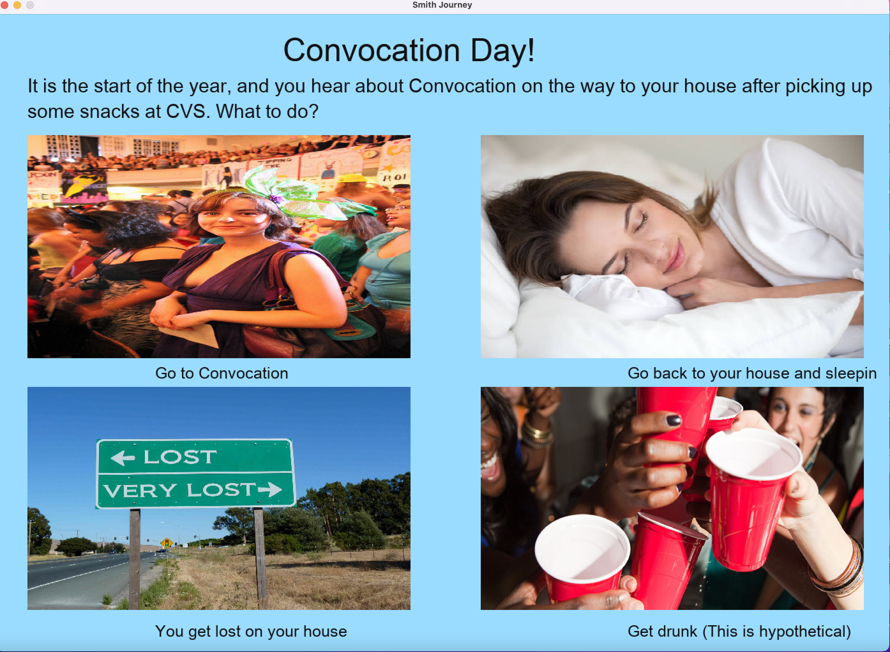
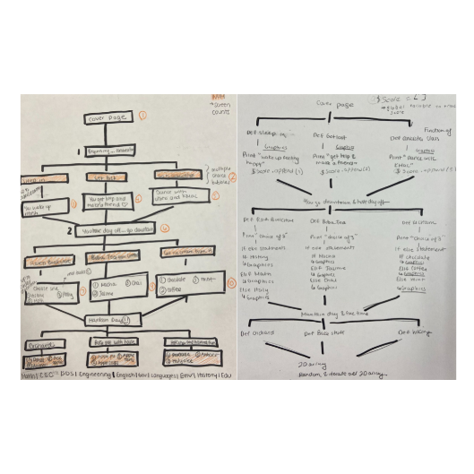

# A Smith Journey
A quiz game that predicts the user’s future possible major based on their choices in different scenarios that are part of Smith College traditions. 

## **How to play the game:**
- Choose your avatar
- Follow the “smith journey”
- Once you get to the first Smith building, you will be prompted to answer the first set of questions and will repeat the process in two other different scenarios.
- After you are done, your suggested major will pop up with some information about the department webpage. 

**Functional Example Game:**

The first diagram on the left explains the flow of the windows that will take place on the user's screen based on the three smith traditons scenarios created. The second diagram shows the pseudocode that was initially thought of to make the game quiz work. 

**Part A: Environment Configuration:**

- Follow the general steps in the next section to set up your local development environment from scratch. Based on your type of machine, please follow one of the guides listed below to help you complete the steps for setting up Smith Journey on your machine.
- Install Ruby 3.1.1
- Check the following webpage and follow the instructions: https://www.ruby-lang.org/en/documentation/installation/
- Use asdf on Mac/Linux systems
- Use the WSL on Windows systems
- Make sure you are using Ruby 3.1.1 before proceeding:
- **cd** smithjourney  then ruby -v to check your version
- On Mac it is strongly recommended that you use asdf to install Ruby. On Windows you should set up your environment through the Windows Subsystem for Linux (WSL). - The guides above explain how to do so in detail.

**Part B: Install Ruby2d**
Follow the instructions to install Ruby2d on your machine. 
https://www.ruby2d.com/learn/get-started/

- Make sure to keep a separate file with both the commands and steps taken since Ruby2d might come with some complications depending on the type of system you have on your machine. Thus, it is important to keep track of the steps taken, so it is easier to look back when lost.
- Should run the smithjourney.rb file and make sure you are in the correct directory and the first directory is final
- Each event is in a different folder, such as Downtown, with its ruby files and a folder containing images images 
- Click on the images to make your choices, and based on those choices you will get your “destined major” 
- Re-play if you would like a backup major! 

**Main Functions Description**

*mouse_down.rb*: This file contains a :mouse_down function that checks the number that $state is to decide what class to make for the questions the user picks. The $state acts as an ID for the questions and for the screen to switch between and allow the user to click on the image options we needed to check the ID of the question. Uses clicks(x, y) or process_click(x, y) function.

*hover_mouse.rb*: Is used to make the image options slightly bigger when the user has their mouse over an image option and then reverts it back to its original dimensions when the user’s mouse is not over the image. Uses over(x, y) function.

*display()*: This creates the images and text for each question that will be displayed after the user makes a choice. 

*clicks(x, y) or process_click(x, y)*: This checks if a user clicks on an image by using .contains? To see if the user’s mouse is within an image. 

*over(x, y)*: This checks if a user’s mouse is over an object to change the dimensions to make the object bigger and then revert it back when the user moves their mouse away. 

*calc_score()*: This takes all the values in the $score array and finds the average to store in a variable, user_score.

*check_major(user_score)*: Check the average computed from the $score array, user_score, and based on that average major will give the user a random major from one of 3 arrays, $stem_majors, $humanities_major, $mixed_majors, that have 5 possible majors in them. 

